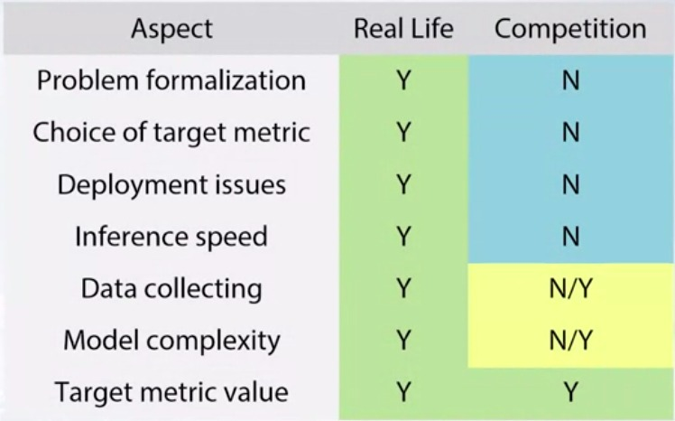

# 01 - Competition Mechanics

## 1. Competitions Concepts

There is a high variety in ML competitions, you may be asked to process text, classify pictures or select the best advertising. However, all competitions have a similar structure constiting of:

### A. Data

It's the training material that is used to produce our solution. It can in different formats; an SSV for several columns, a text file, pictures archive file, a database dump. With the data, you will get a describition which is very important to read in order to understand what we will work with and how to extract the data.

In addition to the data issued by organizers, we can use other data to improve our results. However, you should check if it is legal to use other data than provided.

### B. Model

Our model should have 2 main properties:
1. it should produce best possible predictions
2. it should be reproducible

### C. Submission

This is the stage where your model is compared to other participants' models. You may submit only the predictions, not the models or the source code.

### D. Evaluation

After you submit your solutions (predictions), you need and want to know how accurate or good is your model. This is defined by an evaluation function for example; accuracy, loss, AUC, RMSE, MAE. And of course, that evaluation function is always described and mentioned in the compertition description.

### E. Leaderboard

It will show your ranking compared with other participting teams alongside their performances. However, the score showed in the leaderboard is calculated using a **public subset of the test set**which is used during the competition, and **private subset of the test data**which is used to determine the final ranking.

## 2. Data Science Competitions Platforms

1. Kaggle (most well-known)
2. DrivenData
3. CrowdAnalityx
4. CodaLab
5. DataScienceChallengeClub.net
6. DataScience.net
7. Single-Competition sites (e.g., KDD, VizDooM)

## 3. Why to Participate?

* Great Opportunity for learning and networking
* Interesting non-trivial tasks and state-of-art solutions
* Get famous inside data science community
* Win some money

## 02 - Real World Applications vs Competitions

### Real World ML Pipelines

It's a complicatied process whch includes:
**1. understanding of business problem**
What do we want to do? For what? How it can help the users?
**2. problem formalization**
**3. data collection**
What data can we use? How to mine examples of spam and not-spam?
**4. data cleaning and preprocessing**
**5. modelling**
What model is appropiate for this particular task? How to measure performance? How to select the best model?
**6. evaluate in real life**
We should ensure it works in real scenarios as expected and there was no bias introduces in learning process.
**7. deploy**

### Competitions

For competitions, it's a much simpler process

**<del>1. understanding of business problem</del> Maybe?**
**<del>2. problem formalization</del>**
**<del>3. data collection</del> Maybe?**
**4. data cleaning and preprocessing**
**5. modelling**
**<del>6. evaluate in real life</del>**
**<del>7. deploy</del>**

